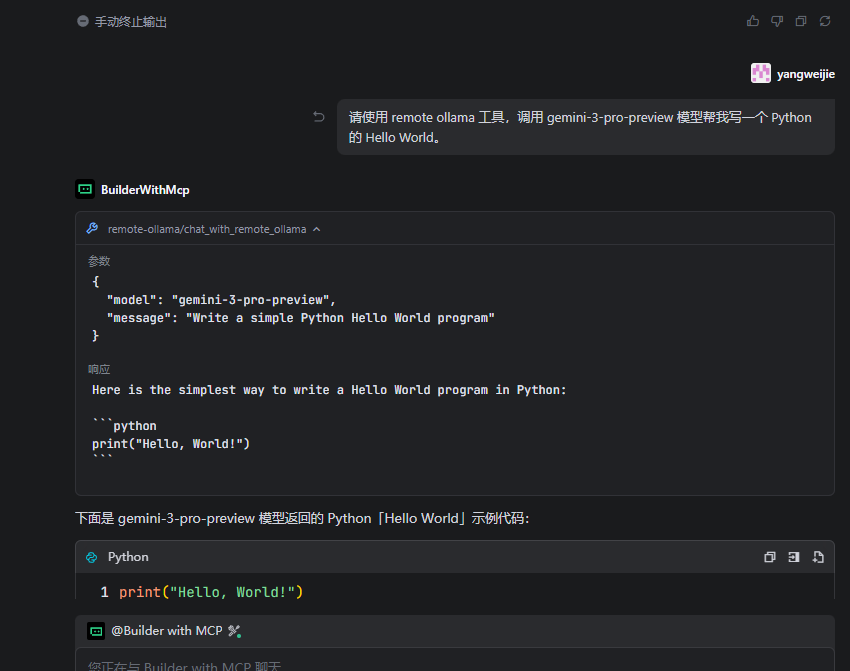

# Ollama Remote MCP

一个基于Model Context Protocol (MCP) 的Ollama远程访问实现。

## 项目概述

本项目实现了一个MCP服务器，提供对Ollama AI模型的远程访问能力。通过MCP协议，可以安全地与远程Ollama实例进行交互。

## 技术栈

- **TypeScript** - 类型安全的JavaScript
- **Model Context Protocol (MCP) SDK** - 标准化的上下文协议实现
- **Zod** - TypeScript优先的schema验证库
- **Node.js** - 运行时环境

## 安装

```bash
# 安装依赖
npm install
```

## 构建

```bash
# 编译TypeScript
npm run build
```

## 使用

### 可用的 MCP 工具

1. **list_ollama_models** - 列出可用模型
   - 参数：`only_remote?: boolean` - 只显示云端模型
   - 功能：获取服务器上所有模型列表，包含大小和更新时间

2. **chat_with_remote_ollama** - 发送对话请求
   - 参数：`model, message, system_prompt?, temperature?`
   - 功能：向指定模型发送对话请求

### 开发模式

```bash
# 编译并运行
npm run build
npm start
```

### 直接运行

```bash
npm start
```

### npx 启动

```bash
# 直接运行
npx ollama-remote-mcp

# 在 Claude Desktop 中使用
# 配置文件中添加 MCP 服务器设置
```

## 环境变量配置

通过环境变量配置远程 Ollama 连接：

- `OLLAMA_BASE_URL` - Ollama 服务器地址（默认：http://localhost:11434）
- `OLLAMA_API_KEY` - API 认证密钥（可选）

### 示例

```bash
# 设置环境变量
export OLLAMA_BASE_URL="https://your-ollama-server.com:11434"
export OLLAMA_API_KEY="your-api-key"

# 运行 MCP 服务器
npx ollama-remote-mcp
```

## 测试

项目包含完整的测试工具，可以快速验证MCP工具功能：

### 快速测试

```bash
# 运行所有测试（连接 + 构建 + 启动）
npm test

# 只测试 Ollama 连接
npm run test:connection

# 只测试构建过程
npm run test:build

# 只测试 MCP 服务器启动
npm run test:start
```

### 高级测试

```bash
# 直接使用测试脚本
node test.cjs all              # 运行所有测试
node test.cjs connection       # 测试连接
node test.cjs build            # 测试构建
node test.cjs start            # 测试启动
node test.cjs help             # 显示帮助
```

### 测试输出示例

```
🔧 Ollama Remote MCP 测试工具
================================

🔌 测试 Ollama 连接...
✅ Ollama 连接成功
📋 发现 2 个模型:
  1. llama3.2:latest (4.7 GB)
  2. codellama:7b (3.8 GB)

🔨 测试构建过程...
✅ 构建成功

🚀 测试 MCP 服务器启动...
✅ MCP 服务器启动成功 (正常运行5秒)

🎉 测试完成!
```

### 测试功能说明

1. **连接测试**: 验证 Ollama API 是否可访问
2. **构建测试**: 运行 `npm run build` 验证 TypeScript 编译
3. **启动测试**: 启动 MCP 服务器并等待 5 秒验证正常运行

### 测试前提条件

- 确保 Ollama 服务器正在运行 (`ollama serve`)
- 确保有至少一个可用的模型
- 网络连接正常（如果使用远程 Ollama）
- Node.js 环境已安装

## 项目结构

```
ollama-remote-mcp/
├── src/                 # TypeScript源文件
├── dist/                # 编译后的JavaScript文件
├── tsconfig.json        # TypeScript配置
├── package.json         # 项目配置和依赖
└── README.md           # 项目文档
```

## 功能特性

- **🤖 列出可用模型** - 查看远程 Ollama 服务器上所有可用模型（本地 + 云端）
- **💬 智能对话** - 向远程 Ollama 模型发送对话请求
- **☁️ 云端支持** - 支持云端和本地模型混合显示
- **🔐 认证支持** - 支持 API Key 认证
- **📊 模型信息** - 显示模型大小、更新时间等详细信息

## trae 使用

### mcp 配置
~~~ json
{
  "mcpServers": {
    "remote-ollama": {
      "command": "npx",
      "args": [
        "ollama-remote-mcp"
      ],
      "env": {
        "OLLAMA_BASE_URL": "https://ollama.com",
        "OLLAMA_API_KEY": "实际api_key"
      }
    }
  }
}
~~~

### 提问
~~~ 
请使用 remote ollama 工具，调用 gemini-3-pro-preview 模型帮我写一个 Python 的 Hello World。
~~~

ps:
> gemini-3-pro-preview 变为了 gemini-3-pro-preview:latest 换 kimi-k2-thinking:cloud 才好使。
~~~

### 效果


## 开发

### 开发依赖

- `typescript`: TypeScript编译器
- `@types/node`: Node.js类型定义

### 生产依赖

- `@modelcontextprotocol/sdk`: MCP SDK实现
- `@cfworker/json-schema`: JSON Schema支持
- `zod`: 数据验证

## 许可证

MIT
